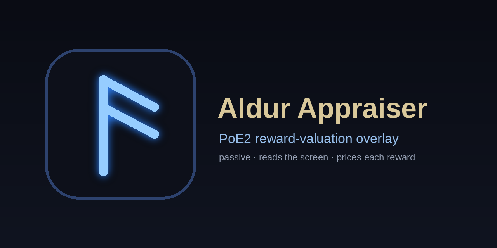

# Aldur Appraiser

<p align="center">
  
</p>

**A passive, read-only overlay for Path of Exile 2.** It reads the *Runeshape Combinations*
panel of the Ezomyte Remnant, prices each reward, and shows the value right next to every
option — so you can pick the best one at a glance, before you commit.

<p align="center"></p>

- **▸ Inline value chips** at each option — in Exalted/Divine with the currency icon; the best
  choice is highlighted in green.
- Excludes the always-paid **bonus reward** from the ranking, ignores hover tooltips, and marks
  rewards it can't price as `?` (never guesses).
- **Read-only by design:** screen capture + OCR only — no clipboard, no input injection, no
  memory reading.
- Runs quietly in the **system tray**. One-file builds for **Windows & macOS**, a setup script
  for **Linux**, prices from [poe2scout](https://poe2scout.com), and a built-in update check.

> **Use at your own risk.** It only reads the screen and draws its own overlay; it never touches
> the game client. There is **no official endorsement** — GGG's third-party policy is strict about
> automation.

### **[⬇ Download the latest release](../../releases/latest)**

## Install

### Prebuilt binary (no Python needed) — Windows & macOS

Download from the [Releases](../../releases) page and run it:

- **Windows:** `aldur-appraiser.exe` — double-click (SmartScreen → "More info" →
  "Run anyway" the first time).
- **macOS (Apple Silicon):** `aldur-appraiser` — first launch is blocked by
  Gatekeeper (right-click → Open, or `xattr -d com.apple.quarantine ./aldur-appraiser`),
  and grant **Screen Recording** permission in System Settings → Privacy.

Capture on Windows/macOS uses `mss` (no extra setup). Run PoE2 in
borderless/windowed fullscreen. Linux users: use the setup script below (the
Wayland capture path needs the distro's GStreamer).

#### First-run security prompt (expected)

The binaries are **not code-signed** (signing certificates cost money), so the OS
shows a one-time warning for a freshly downloaded app. This is expected for an
open-source tool — the app only reads the screen and draws an overlay (no
clipboard, input injection, or memory access; see the source).

- **Windows (SmartScreen):** "Windows protected your PC" → **More info** → **Run
  anyway**. Windows remembers it afterwards.
- **macOS (Gatekeeper):** right-click the app → **Open** → **Open** (or
  `xattr -d com.apple.quarantine ./aldur-appraiser`).

If you'd rather build it yourself instead, see *From source* below.

### From source (recommended on Linux)

The cross-platform setup script creates a venv, installs everything, and checks
your platform's capture prerequisites:

```bash
python scripts/setup.py
python scripts/setup.py --check     # only re-run the environment checks
```

<details>
<summary>Manual install</summary>

```bash
python -m venv .venv
. .venv/bin/activate                # Windows: .venv\Scripts\activate
pip install -e ".[vision,overlay]"  # pricing + RapidOCR + OpenCV + mss + Qt overlay (wheels)
pip install -e ".[tesseract]"       # optional OCR fallback (needs the tesseract binary)
```
</details>

### Screen capture per platform

- **Windows / macOS / Linux-X11:** uses `mss` (bundled wheel) — nothing extra.
  On macOS grant Screen Recording permission to your terminal.
- **Linux / Wayland:** `mss` can't read the screen, so capture goes through
  xdg-desktop-portal + PipeWire. This needs the distro's GStreamer + PyGObject
  (not pip-installable). The setup script detects and names the packages, e.g.
  Fedora/Bazzite: `gstreamer1-plugin-pipewire python3-gobject gstreamer1-plugins-good`
  (on atomic, layer them with `rpm-ostree install …` or use a distrobox).
  First run shows a one-time screen-share dialog; the choice is remembered.

## Usage

```bash
appraiser run                       # runs in the system tray; per-row value chips overlay (default)
appraiser run --corner              # corner HUD list instead of inline chips
appraiser run --console             # plain console output, no tray/overlay
appraiser table --top 15            # dump the live price table
appraiser price "Divine Orb" 3      # value a single reward option
appraiser price "divin orb" 3 --fuzzy
appraiser image panel.png           # appraise rewards from a screenshot
appraiser capture-test              # grab one frame to verify screen capture
```

## Notes

- **Run PoE2 in borderless/windowed fullscreen**, not exclusive fullscreen — exclusive mode
  yields a black capture frame on many Linux setups.
- Prices come from [poe2scout](https://poe2scout.com); cached ~20 min, never fetched per frame.
- Only **currency-vs-currency** choices are ranked reliably. Non-currency rewards (gear, gems,
  thin-market league items) are shown as unknown rather than guessed.
- Calibrate on an **English** client (OCR/snap dictionary).
